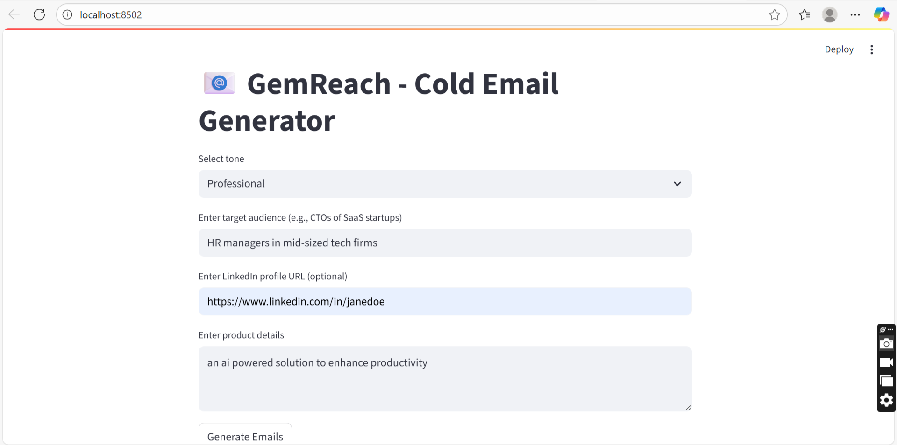
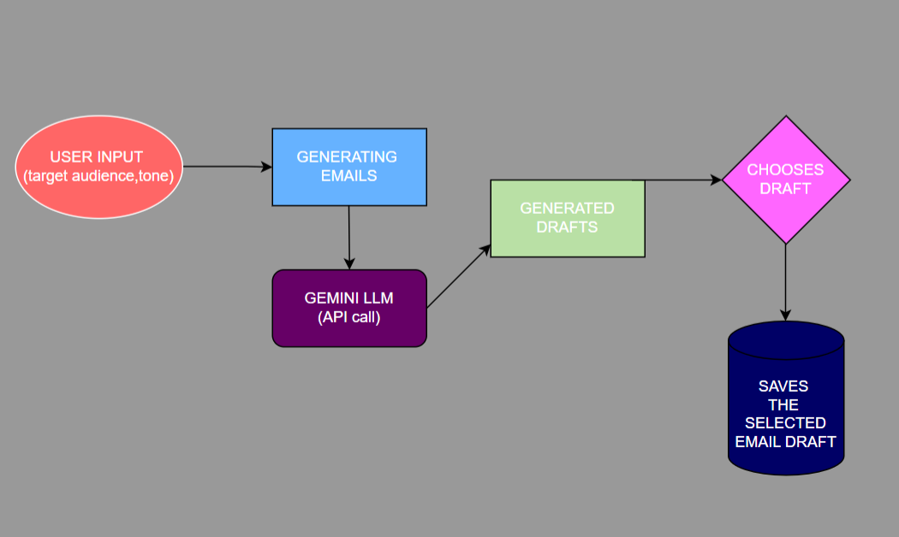

# 🌟 GemReach  

AI-powered assistant to generate and save personalized cold emails using **Google Gemini 2.0 Flash**.  

---

## 📌 About  
**GemReach** is a cold email generator for product/service promotion powered by **Gemini 2.0 Flash LLM**, **Agents framework**, **asyncio**, and **pydantic**.  

It allows users to input details such as **tone, audience, LinkedIn profile url & product details**. The tool then generates **multiple personalized cold email drafts** with different tones and styles. Once reviewed, the selected draft is saved as a text file, ready to be sent.  

💡 **Use Case Example:**  
A startup launches a new **AI-powered SaaS tool** and wants to reach potential clients efficiently. Instead of manually drafting dozens of emails, the business development executive uses GemReach. With just a few inputs, the system creates professional cold emails tailored to the audience—helping save time, maintain consistency, and increase outreach success. 

## 📸 Project Demo

Here’s how GemReach works in action:



---

## ⚙️ Tech Stack  
- **LLM**: Google Gemini 2.0 Flash  
- **Framework**: Agents(for orchestration)  
- **Utilities**: asyncio, pydantic  
- **Interface**: Streamlit 

---

## 🚀 Features

- **Interactive Input Collection**:
Collects key details like tone, target audience, LinkedIn profile, and product details directly from the user.

- **AI-Powered Cold Email Generation**:
Uses Google Gemini 2.0 Flash to generate 5 structured cold email drafts (subject + body) in JSON format.

- **Structured Output with Pydantic**:
Ensures email drafts follow a clean, validated format (subject, body) using pydantic models.

- **Multiple Options**:
Displays several email options so the user can review and choose the most suitable draft.

- **File Saving Utility**:
Allows users to save the chosen cold email into a generated_email.txt file for later use.

- **Async Workflow**:
Uses asyncio to efficiently manage Gemini API calls without blocking execution.

- **Agent-Oriented Design**:
Implements an Agent + Runner workflow for orchestration, enabling easier extension with more tools later (like sending emails, scraping job listings, etc.).
---



## ⚙️ Setup

Follow these steps to run GemReach locally:

**1. Clone the repository** 
```
git clone https://github.com/your-username/GemReach.git
cd GemReach
```

**2. Create a virtual environment (recommended)**
```
venv\Scripts\activate
```
**3. Install Dependencies**
```
pip install -r requirements.txt
```
**4. Set up environment variables**:
Get a Gemini API key from here: [Google AI Studio](https://aistudio.google.com/app/apikey).  
   Inside `.env`, update the value of `GEMINI_API_KEY` with the key you created.

**5. Run the project** 
```
streamlit run app.py
```

Copyright (C) 2025 Harshita Kushwaha. All rights reserved.

This project is licensed under a modified MIT License. 

Permission is hereby granted, free of charge, to any person obtaining a copy 
of this software and associated documentation files (the "Software"), to use, 
copy, modify, and distribute the Software for non-commercial purposes, 
subject to the following conditions:

- Commercial use of this software is strictly prohibited without prior 
  written permission from the author.
- Attribution must be given in all copies or substantial portions of the Software.


